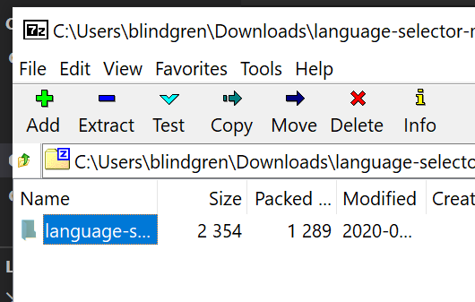
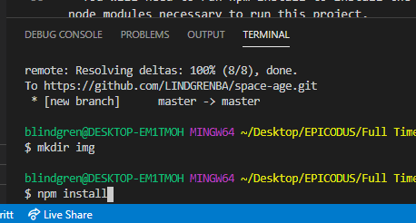
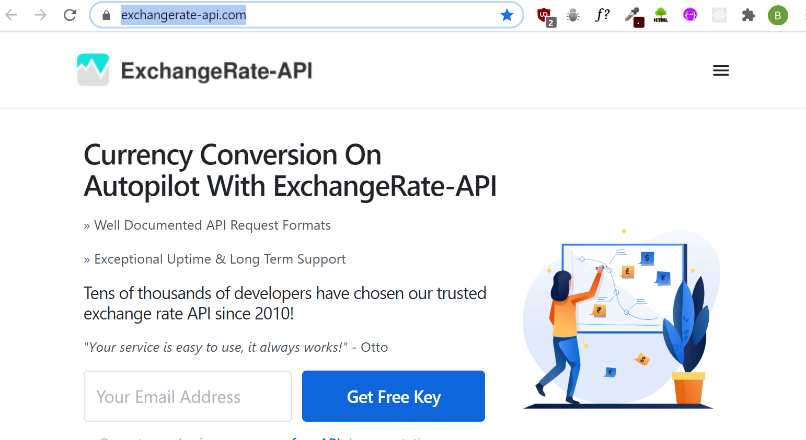
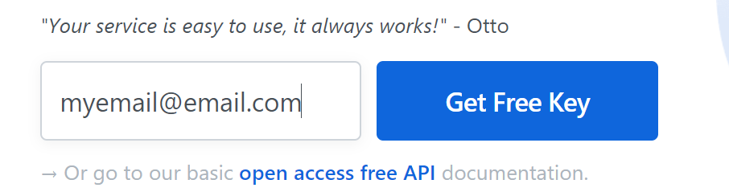
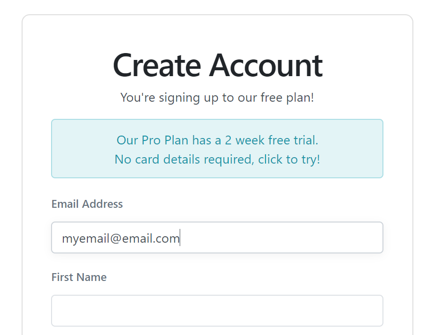
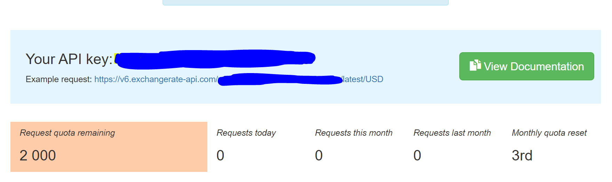

# PROJEC NAME

#### SHORT DESCRIPTION project for Epicodus, 00.00.0000

## By Brittany Lindgren

## Description

ELEVATOR PITCH HERE

## Setup/Installation Requirements

| Steps | Example |
| -------- | ----- |
| Follow this [link to the project repository](PUT LINK HERE) on GitHub.   |  [Link to the project repository](PUT LINK HERE)  |    
| Click on the "Clone or download" button to copy the project link.   |      |   
| If you are comfortable with the command line, you can copy the project link and clone it through your command line with the command `git clone`. Otherwise, I recommend choosing "**Download ZIP**".   |     |   
|  Once the ZIP file has finished downloading, you can right click on the file to view the zip folder in your downloads.   |     |   
| Right click on the project ZIP folder that you have just downloaded and choose the option "**Copy To...**", then choose the location where you would like to save this folder.    |     |   
| Navigate to the final location where you have chosen to save the project folder.   |    |   
| To view the code itself, right click, choose "open with..." and open using a text editor such as VS Code or Atom, etc.   |     |
|  Once you have cloned or downloaded the project and opened it in VS Code or another text editor, open a new terminal by navigating to Terminal -> New Terminal. A terminal will open on the page.  |   |
GET API KEY
ADD .ENV FILE
| In the terminal type the command `npm install` to install node modules. You should see a file called node_modules appear  |    |
| You can now view the project in your browser by typing the command `npm run start` in the terminal  | `npm run start` |

#### Get a unique API Key
| Steps | Example |
| -------- | ----- |
| To get an API key for the currency exchange website, go to the [ExchangeRate-API](https://www.exchangerate-api.com/) website.  |  |
|  Enter your email and click on the 'Get Free Key' button  |    |
|  Enter your information to sign up for a free account  |    |
|  Your API key will be provided to you once you have signed in  |     |
|  Your API key is unique to you. DO NOT SHARE YOUR KEY. Below are the instructions for _`Add .env file`_ which will walk you through setting up a .env file. You will store your key inside of that file to keep it private.  |  see _`Add .env file`_ below  |

#### Add .env file to project
| Steps | Example |
| -------- | ----- |
|Create a file called .env in the head (top) directory of the project|     |
|Inside of the file, 

## Setup/Installation of Node.js and npm

| Steps | Example |
| -------- | ----- |

#### Additional Setup/Installation Notes:

* You will need to run npm install to install the node modules necessary to run this project. 

* Run a server to view this document using npm start.  

## Specifications

| Behavior | Input | Output |  Completed(Y/N?)  | 
| -------- | ----- | ------ | -------- |
|          |       |        |          |

## Known Bugs

| Location (html/css/js & specific location if known) |  Message  | Bug | Resolved (Y/N) |  How was the issue resolved?  |
| ------- | ----- | ------ | ------ | --------- |
|  |  |  |  |  |

## Support and contact details

Please feel free to contact me through GitHub (username: LINDGRENBA) with any questions, ideas or concerns.  

## Technologies Used

* HTML5
* CSS3
* Bootstrap v-4.5.0
* JavaScript
* jQuery v-3.5.0
* Visual Studio Code 
* Git and Git BASH 
* Node.js
* npm package manager
* Webpack

### License

*This site is licensed under the MIT license.*

Copyright (c) 2020 **Brittany A Lindgren_**